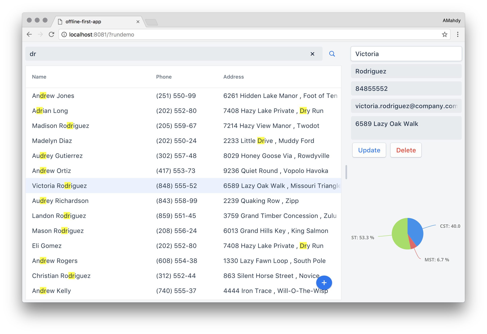

# Offline-First App with WebComponents

# Instructions and updated code, coming soon!



To try out this application, first clone this project locally then:

## Install dependencies

First, make sure you have [Bower](https://bower.io) installed. Then run `bower install` to install local dependencies.

## Install the Polymer-CLI

Also, make sure you have the [Polymer CLI](https://www.npmjs.com/package/polymer-cli) installed. Then run `polymer serve` to serve your application locally.

## Viewing Your Application

```
$ polymer serve
```

The application will be available on this address by default: `http://localhost:8080`
