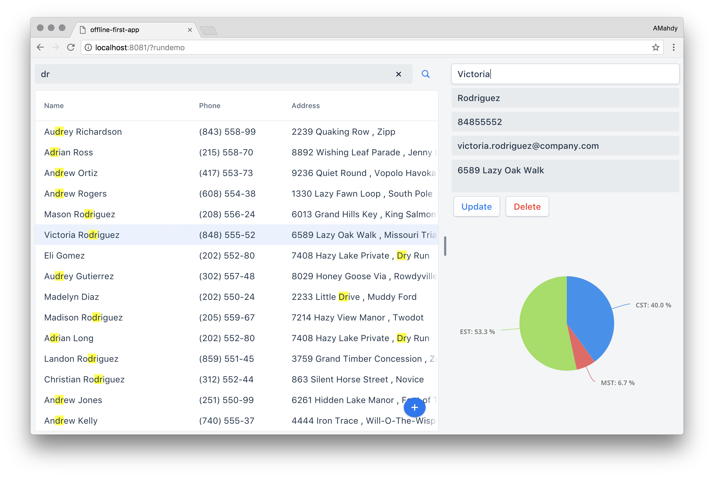

# Offline-First App with WebComponents



## Step by step, building similar app
Here is a guide showing git diffs on how this app was built, highlighting:
* Using WebComponents and Polymer.
* Using PouchDB and its add-ons.
* Storing data locally.
* Modifying local storage.
* Replicating local storage to the remote server.
* Querying local storage.

Those steps are only *the base* for creating a similar app, always check the `master` branch for latest updates added on top of those steps.

[Step 0 | Init empty Polymer app](https://github.com/amahdy/offline-first-app/commit/8dd61d5b74aee8a9409e3795fafd43c471b0e8a9)

[Step 1 | Add a lazily loaded `vaadin-grid`](https://github.com/amahdy/offline-first-app/commit/f2b0d33d30561661bda1ae8f8ab0aedb8afda226)

[Step 2 | Get data from `CouchDB` using `PouchDB`](https://github.com/amahdy/offline-first-app/commit/b70c0b767cb5e64f0d526e67a2ac68a8dda0fe71)

[Step 3 | Load data from local storage](https://github.com/amahdy/offline-first-app/commit/d6a239d81309b9e258b7d59c0926297f1bbe9fa3)

[Step 4 | Add editor for selected item](https://github.com/amahdy/offline-first-app/commit/f6e6c488a2b8fe1f7b25aab4994dae3bb572ed20)

[Step 5 | Persist modifications in local storage](https://github.com/amahdy/offline-first-app/commit/9aba643fa49fcdd8b01714e80a9fccfbc2ba5dd0)

[Step 6 | Sync local storage with remote DB](https://github.com/amahdy/offline-first-app/commit/8de9d673118af212060bc69b218ba78f8a94be84)

[Step 7 | Add search box](https://github.com/amahdy/offline-first-app/commit/0e50c4cc817111ce851602fc585aea271898d5f4)

[Step 8 | Index local storage by firstName](https://github.com/amahdy/offline-first-app/commit/3bd21666971067282b11e86a60f2a487cb86ec5c)

[Step 9 | Query local storage](https://github.com/amahdy/offline-first-app/commit/ca720ac5612b693947b6a50b5c1bba79799242e3)

## Try out this application
First clone this project locally then:

### Installing Dependencies

Make sure you have [Bower](https://bower.io) installed. Then run `bower install` to install local dependencies.

### Installing Polymer-CLI

Also, make sure you have the [Polymer CLI](https://www.npmjs.com/package/polymer-cli) installed. Then run `polymer serve` to serve your application locally.

### Viewing Your Application

```bash
$ polymer serve
```

The application will be available on this address by default: `http://localhost:8080`
